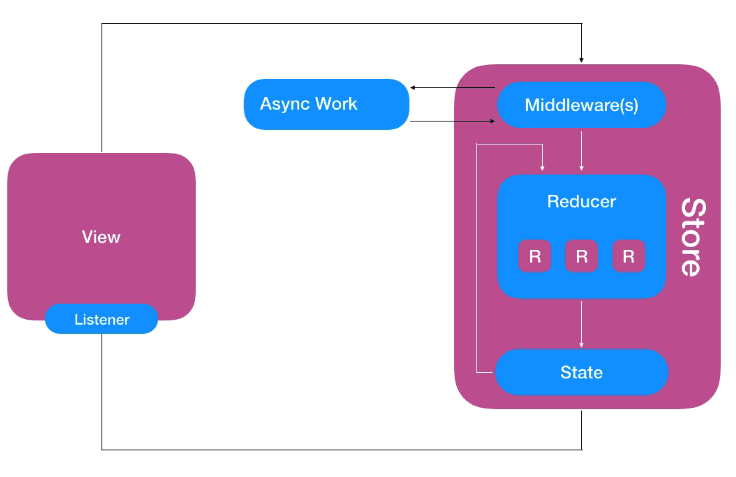

# Caminhante
An outdoor activity mate that shows you nearby Flickr photos on your Apple Watch

---
## Running

### Install homebrew

From your Terminal:
```bash
/usr/bin/ruby -e "$(curl -fsSL https://raw.githubusercontent.com/Homebrew/install/master/install)"
```

If it was previously installed, please update it.
```bash
brew update
```

### Install SwiftLint

From your Terminal:
```bash
brew install swiftlint
```

### Install Carthage

From your Terminal:
```bash
brew install carthage
```

### Xcode

Make sure that your default installation of Xcode is version 9.2 and Swift 4.0.3
```bash
xcode-select -p
xcodebuild -version
swift --version
```

The expected output is:
```
/Applications/Xcode.app/Contents/Developer

Xcode 9.2
Build version 9C40b

Apple Swift version 4.0.3 (swiftlang-900.0.74.1 clang-900.0.39.2)
Target: x86_64-apple-macosx10.9
```

### Install Dependencies

From your Terminal, go to the root directory of your repository and update Carthage libraries:
```bash
cd ~/Documents/code/Caminhante
carthage update
```

### Open Xcode

```bash
open Caminhante.xcodeproj
```

Set the target to `Caminhante watchOS` and the correct device / simulator. In case of real devices, you may want to set the Bundle ID and Provisioning Profile to some that belongs to your iTunes Connect account.

### Flickr Credentials

Duplicate the file `Constants.example.swift` saving the copy with the name `Constants.secret.swift`. This file won't be submited to GitHub, as it should contain sensitive credentials.

An example of what to expect to be the content of this file:
```swift
import Foundation

let flickrURL    = "https://api.flickr.com/services/rest"
let flickrApiKey = "0123456789abcdef0123456789abcdef"
```

### Run it

```Cmd+R```

---
## Architecture

### Redux
Uni-directional Data Flow is a pattern introduced by web frameworks such as Flux and Redux, and later brought to the mobile world by libraries such as [ReSwift]("https://github.com/ReSwift/ReSwift") and [Suas]("https://suas.readme.io/docs/getting-started"). This architecture can be used on top of any other popular architecture for iOS (MVC, MVVM, MVP or VIPER), but on MVC it's really simple and free of boilerplate code: the separation between the *state*, the *View* and the *state mutation* is already enough to make our ViewControllers more lightweight and the whole app completely testable. Besides, you move all your side-effects to the boundaries of the system (*ActionRequest* + *Service*), making it really easy to test (the app workflow is basically made out of pure functions / reducers).



Everything that can be mutated in your app is part of the app state, and managing this state is one of the biggest challenges in a big project where you want to avoid multiple sources of truth, stale data, inconsistency, synchronization conflicts and other problems that can lead to bugs really hard to find and resolve.

For that reason, when using uni-directional data flow we group the whole app state in a store (state machine) and nobody is allowed to mutate it directly. Instead, we use `Actions` to request changes. An Action is usually a very tiny value object describing the change, which may or may not contain associated values. For that reason, Swift `enum` is the perfect data structure for the job.

In a complex Redux Framework, there's the concept of Middleware, which we will skip now as we don't use it in this project. So the next step is mutating the `AppState` according to the `Action` and for that we use `Reducers`. In functional programming, a reducer is a function that takes an initial value and an operation, and returns the result value of the same type as the first input. Here we want the same, something that receives the current state, the action, and returns the new state. The `Store` orchestrates this whole symphony, holding both, current state and the list of reducers, receiving the actions from the views and coordinating the workflow.

Once all the `Reducers` had the opportunity to reduce the state according to the `Action`, the store will set the current state to the new one. This part is really important: you will **never** end up with an inconsistent intermediate state, as the current state remains unchanged until the whole process is done. Different from some Reactive Libraries, here you always have a consistent state and don't have to be worried with partially changed objects.

We are almost there, there's a final step in this workflow, and it's a very important one: notify whoever is interested.

Differently from the other frameworks I mentioned before, my implementation of redux uses the concept of `Signal` to broadcast a change. `Signal` is a data structure popular from ReactiveCocoa, RxSwift and other web libraries and it's basically a continuous version of a `Promise`, that dispatches not only once but every time that a value changes. My implementation was strongly inspired by Swift Talk episodes [#39](https://talk.objc.io/episodes/S01E39-from-futures-to-signals), [#40](https://talk.objc.io/episodes/S01E40-signal-ownership-and-subscriptions) and [#42](https://talk.objc.io/episodes/S01E42-thread-safety), although I went beyond and changed my `Signal<T>` class to be a [functor and a monad](http://www.mokacoding.com/blog/functor-applicative-monads-in-pictures/), in a way that you can subscribe sub-states.

For example, a `ViewController` wanna observe only certain property of your state, so the subscription call will be something like:
```swift
stateSignal
    .map { s in s.substate.grandChild }
    .subscribe { [weak view] grandChild in
        view?.update(grandChild)
    }
```

A `subscript` function using `keyPath` improves this syntax:
```swift
stateSignal[\.substate.grandChild]
    .subscribe { [weak view] grandChild in
        view?.update(grandChild)
    }
```

### Dependency Injection

Inspired by [this article](http://www.danielhall.io/a-swift-y-approach-to-dependency-injection) I wrote a Dependency Injection layer using Protocol Extensions to add traits to a client in a very transparent way. If you want to use the API from a class, all you must do is:
```
class MyClass {
    func checkWeather() {
        apiClient.request(.weather) { w in
            print(w)
        }
    }
}

extension MyClass: HasApiClient { }
```

The last line adds the `apiClient` property to `MyClass`.


### Project structure

Executables:
* Caminhante: the iOS app package (Resources and code)
* Caminhante watchOS: the watchOS app (Resources Bundle)
* Caminhante watchOS Extension: the watchOS app extension (code)

Frameworks:
* CommonLibrary: has all the business logic, the web client, the JSON parsers for the model, the state management and more. It compiles in two Targets:
    * CommonLibrary iOS
    * CommonLibrary watchOS


### UI

As the Apple Watch app should be the main focus of this project, the iOS application is only a companion app that could control remotely the outdoor activity. Even so, make sure that the Watch app is active, otherwise the commands from the iPhone will be ignored. For future versions is possible to use HealthKit to start the Apple Watch app remotely from the iPhone, however this is not the goal here.


---
## Unit Tests

This project uses [Nimble](https://github.com/Quick/Nimble) for assertions.

The focus of these tests are on the state mutation (reducers) and side-effects (action request and services). For the future, the remaining layers are expected to be tested.


The strategy for testing a redux app, by layer:
* Web client: individually if the endpoints are assembling the URLRequest correctly; hot tests to check if the response has the expected http code and integration tests that fetch real data, parse the Json and validate (those can be flaky, should run against a controlled "staging" environment);
* Redux Store: check if the subscription is happening correctly and the notifications are handled properly;
* Redux Reducers: give them a state and an action, check if the result state is what you expect to be;
* Redux Action Request: mock the services around to check if the side-effects are being called correctly; also check if the expected actions are dispatched;
* Model equatable: give a pair of instances and compare them;
* Model serialization: Json parser tests for each domain object that we receive or send;
* AppDelegate: simulate calls to the AppDelegate methods and compare the expected Redux Actions to be dispatched;
* UI: instantiate a ViewController and check its mutable properties in several stages of its life cycle. This can be done by mocking everything around, or have a more "Integration Test" flavor, where you only mock the Network layer and let the other dependencies to work as in real life.

For the UI part is recommended to prefer rendering tests over property assertions, not only makes easier to create and maintain the tests, but in the code review gives you screenshots comparing the view before and after the change, which illustrates the code you are reviewing.

---
## What should come next
* Rendering Unit Tests using [FBSnapshotTestCase](https://github.com/uber/ios-snapshot-test-case/)
* UI Tests using [KIF](https://github.com/kif-framework/KIF)
* [Sourcery](https://github.com/krzysztofzablocki/Sourcery) for code-generation. It creates Auto-Equatable, Auto-Hashable, Auto-Mockable, Lenses. With extended templates it can be used to generate even the boilerplate code for new Redux modules.
* Crashlytics
* Localisable strings
* Redux Middleware for Log
* Redux Middleware for Analytics trackers
* Redux Middleware for state monitoring tools
* Better UI (icons, animations)
* MapKit / routing